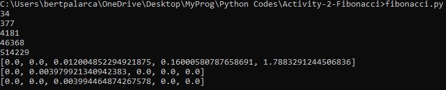

# Activity-2-Fibonacci

A python program for showing the execuion time of using recursion and iteration for solving the fibonacci sequence at a given input sizes.
Find a better algorithm for solving the sequence.

Typical results:

Showing the list of the execution time:

